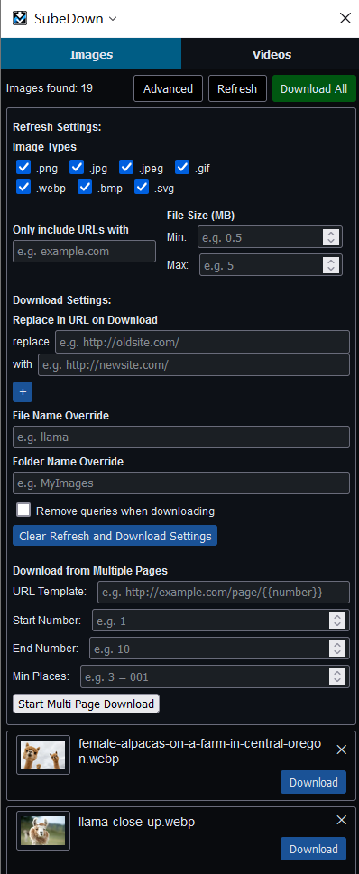

# SubeDown

A fully open-source, privacy-focused, and free Firefox extension for downloading images and videos from web pages, including segmented videos.

Completely free and private: no ads, no trackers, no payments, no subscriptions, no "companion" apps, no data leaves the extension.

Firefox Addon: https://addons.mozilla.org/en-US/firefox/addon/subedown/

Github: https://github.com/machinellama/SubeDown

## Features

- **Image Downloader**: Download all images on a web page with one click, with some advanced options:
  - Replace text in a url (multiple replaces allowed)
  - Filter by image types
  - Filter by image size (min and max)
  - Filter urls that include a specific substring
  - Override the file name or folder name for downloads
  - Download from multiple pages, by using a {{number}} placeholder in the url
- **Video Downloader**: Download videos on a web page
  - Supports segmented videos (e.g. .ts segment files)
  - Note: videos are still a work in progress, but it works for many cases

## Screenshots

## License

MIT License: free to use for personal and commercial use

## Running Locally

1. Clone the repository

2. Open Firefox and enter `about:debugging#/runtime/this-firefox` in the address bar

3. Click on **This Firefox** in the sidebar

4. Click **Load Temporary Add-on...** and select the `manifest.json` file in the cloned repository

5. Best experience if used in the Firefox sidebar

## Contributing

Anyone is welcome to see and contribute code, or create issues.
